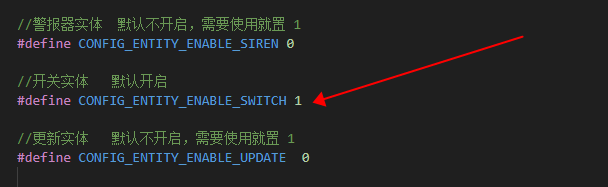

# USB 小夜灯控制器

WiFi MQTT直连HomeAssistant 的USB小夜灯控制器

## 编译说明

### 1. 打开SWITCH 开关实体资源

找到***HomeAssistant/HomeAssistant-C/homeAssistantDevConfig.h*** 头文件，把 宏 **CONFIG_ENTITY_ENABLE_SWITCH** 置 1 以使能资源。


### 2.开启Ai-WB2的链接库

打开***HomeAssistant/HomeAssistant-C/homeAssistantPort.h*** 注释掉 **“#define CONFIG_Ai_M6x”** 并使用 **“#define CONFIG_Ai_WB2”**


### 3. 编译烧录

```
make flash -j32
```
或者 指定USB 口

```
make flash p=/dev/ttyUSB0 -j32
```
## 配网


1.  重复按复位键5次（每次间隔1S左右）
2. 小夜灯闪烁之后就是配网状态
3. 打开微信小程序搜索 **<安信可IOT>**
4. 进入 **Blufi 配网** 界面点击 **扫描设备**
5. 找到一个名称："USB-light-xxxx"的设备
6. 点击连接之后，输入WiFi名称密码
7. 点击**更多信息**，并选择**MQTT服务器**（只需要配置一次）
8. 输入 MQTT服务器地址和端口号（只需要配置一次）
9. 输入完成点击 **配置WiFi**
10. 等待小夜灯熄灭即可配网成功 

## 使用

打开HomeAssistant 的MQTT 集成，就能看到USB 小夜灯控制器设备。


## 自定义修改指导

## 修改设备信息

- 默认设备名称为：**“USB小夜灯控制器”**
- 默认设备厂商为：**“SeaHi”**
- 默认模组名称：**“Ai-WB2”**

自定义命名方法：打开 ***[/components/homeAssistant/dev.ha.h](components/homeAssistant/dev_ha.h)***,

- 设备名称修改：修改**HA_DEVICE_NAME** 宏的默认内容
- 设备厂商修改：修改**HA_DEVICE_MANUFACTURER** 宏的默认内容
- 设备模组修改：修改**HA_DEVICE_MODEL** 宏的默认内容

## 修改实体信息

- 默认实体名称：**“USB小夜灯”**
- 默认unique_id（不建议修改）：**“light1”**
- 默认icon: **“mdi:power”**(一个电源图标)

修改方法：打开 ***[components/homeAssistant/dev_ha.c](components/homeAssistant/dev_ha.c)***，在 **static ha_sw_entity_t sw1** 对象当中修改信息：


## 添加实体请参考[HomeAssistant/README.md](../../HomeAssistant/README.md)